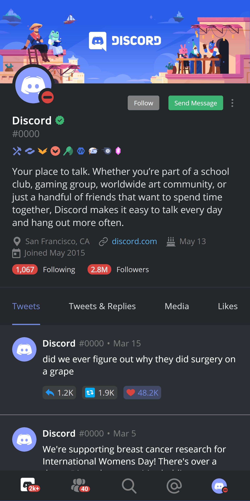

# Twitcord

#### An interactive mobile UI concept of if Twitter was owned by Discord

**LIVE DEMO** - [twitcord.anniew.xyz](https://twitcord.anniew.xyz/) OR [twitcord.netlify.app](https://twitcord.netlify.app)

Users can click on reactions, follow button, and tweets navigation bar.

_Inspired by [this reddit post](https://www.reddit.com/r/discordapp/comments/lxjoe1/if_twitter_were_owned_by_discord/)._

    
    
    
    
    

    

### Built With

- 💙 [HTML5](https://www.w3schools.com/html/)
- 💜 [CSS3](https://www.w3schools.com/css/)
- 💙 [JavaScript](https://www.w3schools.com/js/DEFAULT.asp)

### Hosted On

- 💜 [Netlify](https://www.netlify.com/)

---

## Contributing

Pull requests are welcome. For major changes, please open an issue first to discuss what you would like to change. Please make sure to update tests as appropriate.

### How To Contribute

1. Fork the repository to your own Github account.
2. Clone the project to your machine.
3. Create a branch locally with a succinct but descriptive name.
4. Commit changes to the branch.
5. Following any formatting and testing guidelines specific to this repo.
6. Push changes to your fork.
7. Open a Pull Request in my repository.

---

## Creator

Annie Wu ([anniedotexe](https://github.com/anniedotexe))

Copyright &copy; 2021-2026 Annie Wu. All rights reserved.

I do not maintain this code anymore and will not respond to any questions sent to me.

If you like my content or find this code useful, give it a ⭐ or support me by buying me a coffee ☕💙

